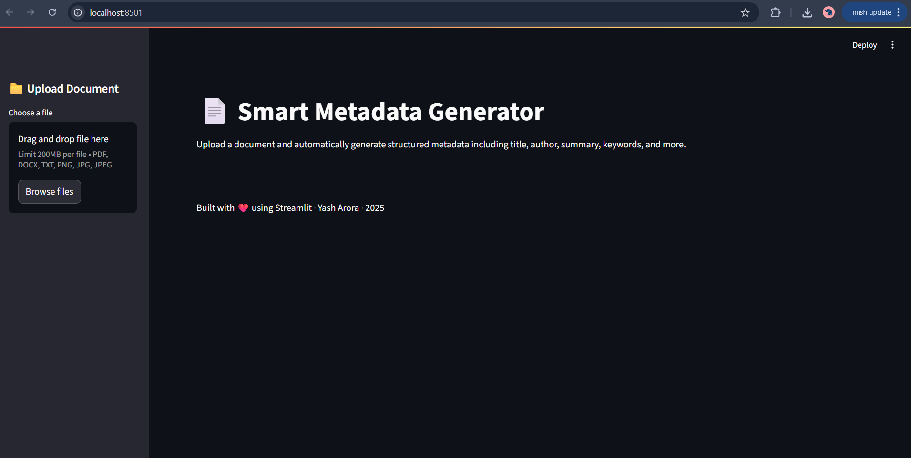
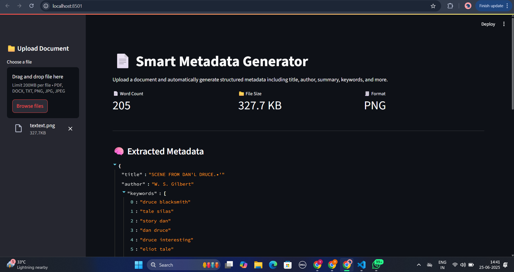
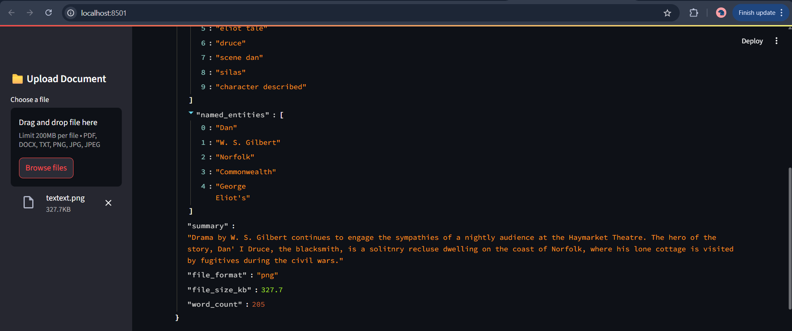
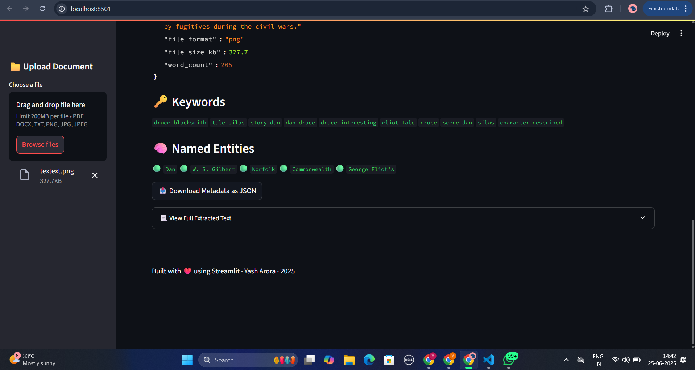

# 📄 Smart Metadata Generator

A powerful Streamlit-based web application that automatically extracts **structured metadata** from uploaded documents using **Natural Language Processing (NLP)** and **cloud-based OCR**.  
Supports PDFs, DOCX, TXT, and image files (`PNG`, `JPG`, `JPEG`).

---

## 🚀 Features

- 📤 Upload and analyze documents of multiple types
- 🔍 Extracts:
  - **Title**
  - **Author**
  - **Keywords** (via KeyBERT)
  - **Named Entities** (via spaCy)
  - **Summary** (via HuggingFace Transformers)
- 📦 Displays:
  - **Word Count**
  - **File Size**
  - **File Format**
- ☁️ Performs **OCR** on scanned/image PDFs and images using [OCR.Space API](https://ocr.space/ocrapi)
- 📥 Download metadata in **JSON** format

---

## 🧪 Technologies Used

- **Streamlit** – Web interface
- **spaCy** – Named Entity Recognition (NER)
- **KeyBERT** – Keyword extraction
- **HuggingFace Transformers** – Text summarization (`facebook/bart-large-cnn`)
- **OCR.Space** – Cloud OCR for image-based documents
- **PyMuPDF (fitz)** – PDF text extraction
- **docx / PIL / pdf2image** – Format handling

---

## 🖼 Screenshots

### 🔹 Home Page


### 🔹 Upload Document & Preview


### 🔹 Extracted Metadata




## 🛠️ Installation

### 🐍 1. Clone the repository

```bash
git clone https://github.com/yasharora1312/metadata-generator.git
cd metadata-generator

metadata-generator/
├── Mars1.py                    # Streamlit application main script
├── requirements.txt            # Python dependencies
├── README.md                   # Project documentation
├── textext.png                 # Sample input image for testing
├── screenshots/                # Screenshots for README
│   ├── home.png
│   ├── upload.png
│   ├── metadata.png
│   ├── metadata1.png
│   └── metadata2.png
└── .git/                       # Git tracking directory (hidden)

